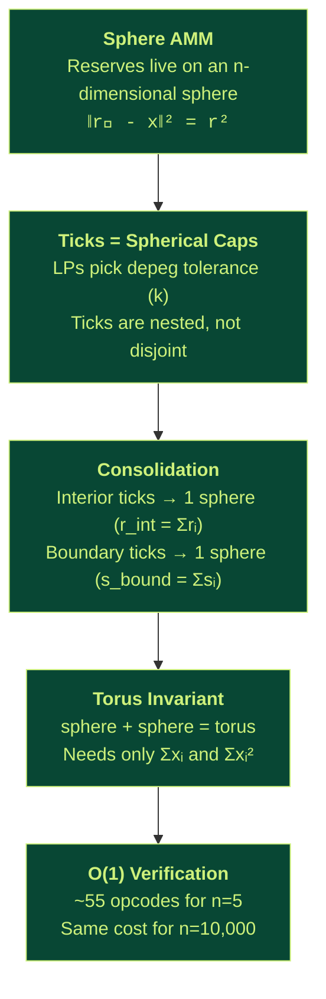
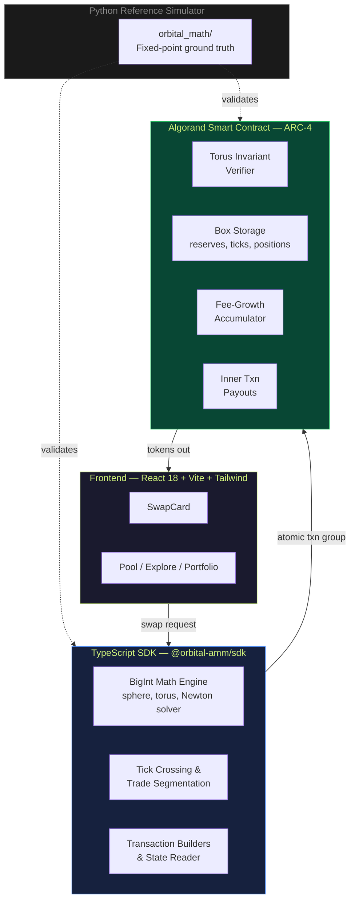

<p align="center">
  
</p>

<h1 align="center">TaurusSwap</h1>

<p align="center">
  <strong>Multi-asset concentrated liquidity AMM on Algorand, powered by sphere &amp; torus geometry.</strong>
</p>

<p align="center">
  <a href="https://algorand.co"></a>
  
  
  
  
  
  
  
</p>

---

## The Problem

Existing DEX designs force a painful tradeoff:

| | Uniswap V3 | Curve | **TaurusSwap** |
|---|---|---|---|
| Tokens per pool | 2 | n | **n** |
| Concentrated liquidity | Yes | No | **Yes** |
| On-chain verification | O(1) | O(n) | **O(1)** |
| Capital efficiency at $0.99 depeg (n=5) | N/A (2-token only) | 1x | **~150x** |

**Uniswap V3** gives you concentrated liquidity but only for pairs. Five stablecoins need 10 separate pools, fragmenting liquidity across all of them.

**Curve** supports multi-asset pools but forces every LP into the same uniform profile. No LP can say "I only want exposure near the $1 peg."

**TaurusSwap** solves both. Using the geometry of n-dimensional spheres, it enables concentrated liquidity positions (ticks) across arbitrarily many tokens in a single pool, with O(1) on-chain verification regardless of pool size.

> For the full mathematical derivation, architecture deep-dive, and visual explanations, see the **[Documentation](docs/README.md)**.

---

## How It Works (30-Second Version)



1. **Sphere AMM** -- Pool reserves sit on the surface of an n-dimensional sphere centered at (r, r, ..., r)
2. **Ticks as spherical caps** -- LPs define how far from the $1 peg they provide liquidity (parameter k). Ticks are nested, not disjoint
3. **Consolidation** -- All interior ticks collapse into one sphere (radius = sum of radii). All boundary ticks collapse into another. Two spheres form a **torus**
4. **O(1) verification** -- The torus equation uses only `sum(reserves)` and `sum(reserves²)`. Updating these for a 2-token swap is constant-time, regardless of pool size
5. **Compute off-chain, verify on-chain** -- The SDK solves the quartic trade equation. The smart contract only checks the torus invariant holds

---

## Architecture



**The principle:** The SDK computes; the contract verifies. The contract never solves the quartic — it only checks that the proposed post-trade state satisfies the torus equation within tolerance.

---

## Project Structure

```
taurusSwap/
├── contracts/                  # Algorand smart contract + reference math
│   ├── orbital_math/           # Python fixed-point math simulator
│   │   ├── sphere.py           # Sphere invariant, pricing, equal-price point
│   │   ├── polar.py            # Polar reserve decomposition (α, w)
│   │   ├── torus.py            # Torus residual & verification
│   │   ├── ticks.py            # Tick bounds, virtual reserves, capital efficiency
│   │   ├── consolidation.py    # Interior/boundary tick consolidation
│   │   ├── newton.py           # Newton + bisection trade solver
│   │   ├── crossings.py        # Tick crossing detection & segmentation
│   │   └── models.py           # Tick, TradeSegment, ConsolidatedState
│   ├── smart_contracts/
│   │   └── orbital_pool/
│   │       └── contract.py     # The on-chain OrbitalPool (ARC-4)
│   ├── scripts/
│   │   ├── deploy_testnet.py   # Testnet deployment
│   │   ├── deploy_localnet.py  # Localnet deployment
│   │   └── seed_testnet_pool.py# Post-deploy liquidity seeding
│   └── tests/                  # 45 passed, 3 skipped
│
├── sdk/                        # TypeScript SDK (@orbital-amm/sdk)
│   ├── src/math/               # BigInt sphere, torus, Newton, crossings
│   ├── src/pool/               # swap, liquidity, quote, state-reader
│   ├── src/algorand/           # Tx builders, box encoding, ABI
│   └── tests/
│
├── frontend/                   # React + Vite + Tailwind + shadcn/ui
│   └── src/
│       ├── components/swap/    # SwapCard, TokenSelectorModal
│       ├── components/landing/ # Hero, Features, BentoGrid, FAQ
│       └── pages/              # Index, Explore, Pool, Portfolio
│
├── animations/                 # Manim scripts for math visualizations
│   ├── 01_sphere_amm.py       # Sphere surface & reserve dynamics
│   ├── 02_polar_decomposition.py # α and w decomposition
│   ├── 03_ticks_and_caps.py   # Spherical caps & concentrated liquidity
│   ├── 04_consolidation.py    # Interior + boundary → torus
│   └── 05_trade_execution.py  # Complete swap walkthrough
│
└── docs/                       # Full documentation
    └── README.md               # Start here
```

---

## Quick Start

### Prerequisites

- Python 3.12+, Node.js 18+, AlgoKit CLI v2+, Docker (for localnet)

### 1. Clone & Install

```bash
git clone <repo-url> && cd taurusSwap

# Contracts + math simulator
cd contracts
source ~/python/bin/activate
pip install -e ".[dev]"

# SDK
cd ../sdk
npm install

# Frontend
cd ../frontend
npm install
```

### 2. Build & Test

```bash
# Contract
cd contracts
source ~/python/bin/activate
algokit project run build
algokit project run test          # 45 passed

# SDK
cd ../sdk
npm test

# Frontend
cd ../frontend
npm run dev
```

### 3. Deploy (Localnet)

```bash
cd contracts
source ~/python/bin/activate
algokit localnet start
algokit project deploy localnet
```

### 4. Deploy (Testnet)

```bash
cd contracts
source ~/python/bin/activate
export ORBITAL_MNEMONIC="your 25-word testnet mnemonic"
export ORBITAL_CREATE_MOCK_ASSETS=1
algokit project deploy testnet
```

### 5. Seed Liquidity

```bash
export ORBITAL_APP_ID=<app-id-from-deploy>
export ORBITAL_TRADER_ADDRESSES="ADDR1,ADDR2"
python scripts/seed_testnet_pool.py
```

### 6. Render Math Animations

```bash
source ~/python/bin/activate
cd animations
manim -pql 01_sphere_amm.py SphereAMM           # 480p preview
manim -pqh 04_consolidation.py TorusFormation    # 1080p render
```

---

## Key Numbers

| Metric | Value |
|--------|-------|
| Capital efficiency (n=5, $0.99 depeg) | **~150x** vs Curve |
| Capital efficiency (n=5, $0.95 depeg) | **~30x** vs Curve |
| On-chain verification cost | **~55 opcodes** (n=5) |
| Finality | **3.3 seconds** |
| Max tokens per pool | **Unlimited** (tested to n=5) |
| Trade invariant complexity | **O(1)** regardless of n |

---

## Documentation

The full documentation lives in [`docs/`](docs/README.md) and covers:

| Document | What You'll Learn |
|----------|-------------------|
| [Problem Statement](docs/01-problem-statement.md) | Why existing AMMs fail at multi-asset concentrated liquidity |
| [Mathematical Foundations](docs/02-mathematical-foundations.md) | Sphere AMM, pricing, equal-price point, polar decomposition |
| [The Torus Invariant](docs/03-torus-invariant.md) | Tick consolidation, the torus equation, O(1) verification |
| [Tick Mechanics](docs/04-tick-mechanics.md) | Spherical caps, k-bounds, virtual reserves, capital efficiency |
| [Trade Execution](docs/05-trade-execution.md) | Quartic equation, Newton solver, tick crossings, segmentation |
| [Smart Contract](docs/06-smart-contract.md) | On-chain architecture, box storage, fee accounting, ABI |
| [TypeScript SDK](docs/07-sdk.md) | Math engine, transaction builders, public API |
| [Deployment Guide](docs/08-deployment.md) | Localnet, testnet, seeding, environment variables |
| [Seeding Process](docs/10-seeding-process.md) | How pools go from empty to live with initial liquidity |

---

## Math Animations

Inspired by [Paradigm's Orbital paper](https://www.paradigm.xyz/2025/06/orbital), we built manim animation scripts that visually explain the core mathematics. These produce videos suitable for presentations, demos, and educational content.

| Animation | What It Shows |
|-----------|--------------|
| `01_sphere_amm.py` | 3D sphere surface, reserve point moving along it during trades |
| `02_polar_decomposition.py` | Splitting reserves into parallel (alpha) and orthogonal (w) components |
| `03_ticks_and_caps.py` | Spherical caps as concentrated liquidity regions |
| `04_consolidation.py` | Multiple ticks collapsing into a single torus |
| `05_trade_execution.py` | End-to-end swap: input, Newton solve, invariant check, output |
| `06_seeding_process.py` | Pool seeding: validation, funding, ASA distribution, add_tick |

---

## Based On

This implementation is based on the **Orbital** paper by Dave White, Dan Robinson, and Ciamac Moallemi (Paradigm, June 2025).

**Paper:** [paradigm.xyz/2025/06/orbital](https://www.paradigm.xyz/2025/06/orbital)

The key insight from the paper: by using sphere geometry for AMM invariants, multi-asset concentrated liquidity becomes possible with constant-time on-chain verification through a torus equation.

---

## Contributors

<table>
  <tr>
    <td align="center"><a href="https://github.com/MitudruDutta"><br /><sub><b>Mitudru Dutta</b></sub></a></td>
    <td align="center"><a href="https://github.com/pauldebanshu19"><br /><sub><b>Debanshu Paul</b></sub></a></td>
    <td align="center"><a href="https://github.com/Kaushik2003"><br /><sub><b>Kaushik</b></sub></a></td>
  </tr>
</table>

---

<p align="center">
  <sub>Compute off-chain. Verify on-chain. Trade without limits.</sub>
</p>
