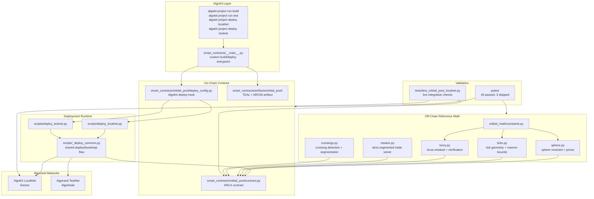
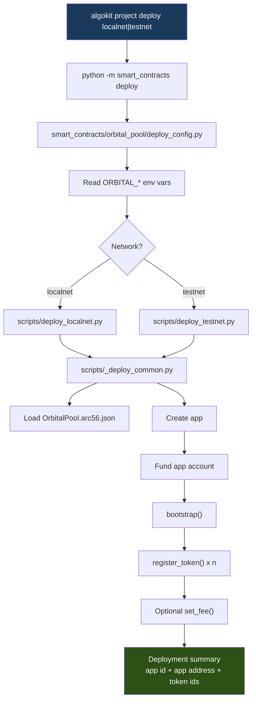
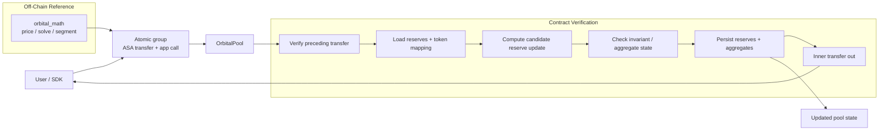

# Taurus


Taurus is the Algorand smart-contract workspace for the Orbital AMM. It contains the on-chain `OrbitalPool` contract, the fixed-point Python math simulator used as the reference model, the AlgoKit deployment hooks, and the localnet/testnet deployment scripts.

This repository is built around a compute-off-chain, verify-on-chain model. The math simulator solves pricing, tick consolidation, crossing detection, and segmented trade paths off-chain. The contract verifies claims, updates pool state, and executes token transfers on-chain.


## Why This Workspace Matters

Orbital is not a standard x*y=k AMM. It is a multi-asset, concentrated-liquidity design built around sphere and torus invariants. That makes two things non-negotiable:

- the off-chain math has to be deterministic and fixed-point safe
- the on-chain contract has to verify proposed state transitions cheaply and consistently

This workspace exists to keep those two halves aligned. The Python math package is the reference model. The Algorand contract is the verifier/executor. The tests check that both halves agree.

## System Architecture



## Deployment Pipeline



## Runtime Verification Flow



## Current Implementation Status

| Area | Status | Notes |
|---|---|---|
| Fixed-point math simulator | Done | Sphere, torus, tick geometry, Newton solver, crossings, consolidation |
| AlgoKit build flow | Done | `algokit project run build` works |
| Non-localnet test suite | Done | `45 passed, 3 skipped` |
| Localnet deployment | Done | `algokit project deploy localnet` works |
| Testnet deployment | Done | `algokit project deploy testnet` works with valid env vars |
| Single-tick swap path | Working | Covered by contract and localnet tests |
| Multi-crossing protocol completeness | Partial | Not a finished production path yet |
| Full LP lifecycle completeness | Partial | Core scaffolding exists; not a fully finished protocol surface |

## AlgoKit Commands

Run all commands from `contracts/`:

```bash
cd /home/btwitsvoid/Documents/algo/orbital/contracts
source ~/python/bin/activate
```

| Command | Purpose |
|---|---|
| `algokit project run build` | Compile `OrbitalPool` into ARC56 + TEAL artifacts |
| `algokit project run test` | Run the Python math + contract unit suite |
| `algokit project deploy localnet` | Deploy, fund, bootstrap, and register tokens on localnet |
| `algokit project deploy testnet` | Deploy, fund, bootstrap, and register tokens on testnet |
| `algokit localnet start` | Start Docker-backed AlgoKit localnet |
| `algokit localnet status` | Check whether localnet is up |
| `algokit localnet stop` | Stop localnet containers |

Recommended shell form on this machine:

```bash
algokit project run build
algokit project run test
algokit project deploy localnet
algokit project deploy testnet
```

## Quick Start

### Install

```bash
cd /home/btwitsvoid/Documents/algo/orbital/contracts
source ~/python/bin/activate
pip install -e ".[dev]"
```

### Build

```bash
cd /home/btwitsvoid/Documents/algo/orbital/contracts
source ~/python/bin/activate
algokit project run build
```

### Validate

```bash
cd /home/btwitsvoid/Documents/algo/orbital/contracts
source ~/python/bin/activate
algokit project run test
```

### Run LocalNet

```bash
cd /home/btwitsvoid/Documents/algo/orbital/contracts
source ~/python/bin/activate
algokit localnet start
algokit project deploy localnet
RUN_LOCALNET=1 python -m pytest tests/test_orbital_pool_localnet.py -v
```

### Deploy to TestNet

Using mock assets:

```bash
cd /home/btwitsvoid/Documents/algo/orbital/contracts
source ~/python/bin/activate

export ORBITAL_MNEMONIC="your valid 25 word testnet mnemonic"
export ORBITAL_CREATE_MOCK_ASSETS=1

algokit project deploy testnet
```

Using existing ASAs:

```bash
cd /home/btwitsvoid/Documents/algo/orbital/contracts
source ~/python/bin/activate

export ORBITAL_MNEMONIC="your valid 25 word testnet mnemonic"
export ORBITAL_ASSET_IDS="123,456,789,101112,131415"

algokit project deploy testnet
```

### Post-Deploy Seeding

Deployment only creates/registers the ASAs and bootstraps the app. It does **not** seed liquidity.

The operational flow is:

1. deploy the pool
2. have trader wallets opt into all 5 ASAs
3. run the seeding script

The seeding step:

- verifies the trader wallets are opted in
- tops the trader wallets up with ALGO for fees
- distributes test ASAs from the creator to the trader wallets
- adds the first liquidity tick from the creator account

Example:

```bash
cd /home/btwitsvoid/Documents/algo/orbital/contracts
source ~/python/bin/activate

export ORBITAL_APP_ID=758226184
export ORBITAL_MNEMONIC="your valid 25 word testnet mnemonic"
export ORBITAL_TRADER_ADDRESSES="ADDR1,ADDR2"
export ORBITAL_TRADER_TOKEN_AMOUNT=1000000000
export ORBITAL_TRADER_FUND_MICROALGOS=500000
export ORBITAL_SEED_R=1000000000
export ORBITAL_DEPEG_PRICE_SCALED=990000000

algokit project run seed-testnet
```

## Environment Variables

These are the deploy-time variables the AlgoKit hook understands:

| Variable | Purpose |
|---|---|
| `ORBITAL_MNEMONIC` | Direct 25-word testnet mnemonic |
| `ORBITAL_ACCOUNT_NAME` | Alternative AlgoKit account alias for env-based loading |
| `ORBITAL_ASSET_IDS` | CSV list of existing ASA ids |
| `ORBITAL_CREATE_MOCK_ASSETS` | `1` to create mock testnet ASAs |
| `ORBITAL_FEE_BPS` | Optional initial pool fee in basis points |
| `ORBITAL_FUND_MICROALGOS` | App funding amount |
| `ORBITAL_N` | Number of tokens in the pool |
| `ORBITAL_DEPLOY_JSON` | `1` to print JSON deployment output |
| `ORBITAL_DEPLOY_OUTPUT` | Path to write deployment summary JSON |
| `ORBITAL_APP_ID` | App id used by the post-deploy seeding script |
| `ORBITAL_TRADER_ADDRESSES` | CSV list of trader wallets that should receive test balances |
| `ORBITAL_TRADER_TOKEN_AMOUNT` | Amount of each ASA to distribute to each trader |
| `ORBITAL_TRADER_FUND_MICROALGOS` | ALGO top-up target for each trader wallet |
| `ORBITAL_SEED_R` | Initial seed tick radius |
| `ORBITAL_SEED_K` | Explicit initial seed tick `k` override |
| `ORBITAL_DEPEG_PRICE_SCALED` | PRECISION-scaled depeg target used to derive `k` |
| `ORBITAL_SEED_OUTPUT` | Path to write seeding summary JSON |

The deploy hook intentionally does not guess assets on testnet. You must provide either:

- `ORBITAL_CREATE_MOCK_ASSETS=1`
- or `ORBITAL_ASSET_IDS="..."`

The deploy default is a 5-token Orbital pool. Override it only if you intentionally want a different `n`.

## Test Matrix

| Test File | Scope |
|---|---|
| `tests/test_sphere.py` | Equal-price point, sphere invariant, spot pricing |
| `tests/test_polar.py` | Polar decomposition and aggregate geometry |
| `tests/test_ticks.py` | Tick bounds, reserve bounds, capital efficiency |
| `tests/test_consolidation.py` | Tick consolidation into `r_int`, `s_bound`, `k_bound` |
| `tests/test_torus.py` | Torus residual and verifier behavior |
| `tests/test_newton.py` | Strict single-segment solver |
| `tests/test_crossings.py` | Crossing detection and segmented trades |
| `tests/test_orbital_pool_contract.py` | Contract-level unit tests |
| `tests/test_orbital_pool_localnet.py` | Live localnet deployment + state reconciliation |

Current baseline:

```text
45 passed, 3 skipped
```

Localnet deployment has also been validated through AlgoKit and the shared deploy path.

## Project Layout

```text
contracts/
├── .algokit.toml                        # AlgoKit project config
├── pyproject.toml                       # Python + pytest + dev dependencies
├── poetry.toml                          # Poetry local config
├── README.md                            # This file
├── Orbital_AMM_Implementation_Manual.pdf
├── TASK_DIVISION.md
├── orbital_math/
│   ├── __init__.py
│   ├── constants.py
│   ├── fixed_point.py
│   ├── sphere.py
│   ├── polar.py
│   ├── ticks.py
│   ├── consolidation.py
│   ├── torus.py
│   ├── newton.py
│   ├── crossings.py
│   └── models.py
├── scripts/
│   ├── _deploy_common.py                # Shared deploy/bootstrap logic
│   ├── deploy_localnet.py               # Localnet deploy entrypoint
│   ├── deploy_testnet.py                # Testnet deploy entrypoint
│   └── seed_testnet_pool.py             # Post-opt-in trader distribution + initial pool seeding
├── smart_contracts/
│   ├── __init__.py
│   ├── __main__.py                      # AlgoKit build/deploy command bridge
│   ├── artifacts/
│   │   └── orbital_pool/
│   │       ├── OrbitalPool.arc56.json
│   │       ├── OrbitalPool.approval.teal
│   │       ├── OrbitalPool.clear.teal
│   │       ├── OrbitalPool.approval.puya.map
│   │       └── OrbitalPool.clear.puya.map
│   └── orbital_pool/
│       ├── __init__.py
│       ├── contract.py
│       └── deploy_config.py
└── tests/
    ├── test_sphere.py
    ├── test_polar.py
    ├── test_ticks.py
    ├── test_consolidation.py
    ├── test_torus.py
    ├── test_newton.py
    ├── test_crossings.py
    ├── test_orbital_pool_contract.py
    └── test_orbital_pool_localnet.py
```

## Deployment Notes

What the deploy scripts do:

- load the compiled `OrbitalPool.arc56.json`
- create the app
- fund the app account
- call `bootstrap()`
- register each pool token
- optionally set the fee

What they do not do:

- they do not add liquidity
- they do not run swaps
- they do not prove the protocol is production complete

That distinction matters. A successful deploy means the app exists and base storage is initialized. It does not mean every protocol path is finished.

## Common Pitfalls

| Problem | Cause | Fix |
|---|---|---|
| `mnemonic length must be 25` | Invalid Algorand mnemonic | Use a real 25-word mnemonic |
| `Testnet deployment needs explicit assets` | No asset mode selected | Set `ORBITAL_CREATE_MOCK_ASSETS=1` or `ORBITAL_ASSET_IDS` |
| `txn dead: round ... outside of ...` | Stale suggested params | Fixed in deploy code; pull latest changes and retry |
| Localnet unreachable | Docker/localnet not running | `algokit localnet start` |
| Nested artifacts path | Running raw PuyaPy from the wrong directory | Prefer `algokit project run build` |

## What To Use Next

If your goal is contract iteration, use this order:

1. `algokit project run build`
2. `algokit project run test`
3. `algokit project deploy localnet`
4. `RUN_LOCALNET=1 python -m pytest tests/test_orbital_pool_localnet.py -v`
5. `algokit project deploy testnet`

That sequence is the cleanest path through this workspace today.
