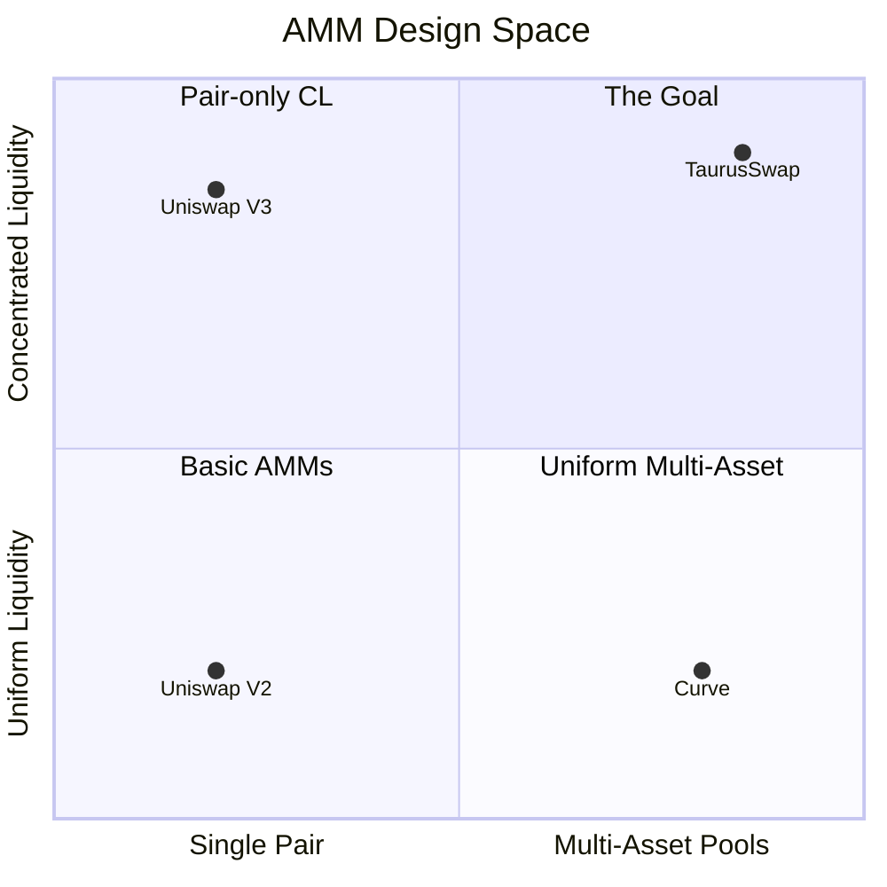

# 1. Problem Statement

## The Two-Body Problem of DeFi AMMs

Every existing AMM is forced to choose between two capabilities. No current design achieves both.

### Capability A: Multi-Asset Pools

**Curve** supports pools with n tokens (3pool, tri-crypto, etc.). A single pool holds USDC, USDT, DAI — traders swap between any pair without splitting liquidity across separate pools.

But Curve forces every LP into the **same uniform liquidity profile**. There's no way for an LP to say "I'm confident these stablecoins stay within $0.99-$1.01, let me concentrate my capital there." Every LP must cover the full depeg range equally.

### Capability B: Concentrated Liquidity

**Uniswap V3** lets each LP choose a price range. An LP who believes ETH stays between $3,000-$3,500 concentrates capital there, earning more fees per dollar deployed than a full-range LP.

But Uniswap V3 only supports **2 tokens per pool**. Five stablecoins need C(5,2) = 10 separate pools. Liquidity is fragmented, routing is complex, and slippage increases.

### The Tradeoff Visualized

**No existing AMM occupies the upper-right quadrant — until now.**

## Why This Is Hard

The mathematical reason is dimensional. Uniswap V3's concentrated liquidity works because in 2D, price ranges are intervals on a 1D number line — easy to partition, stack, and iterate.

In n dimensions, there is no obvious analogue. What does a "price range" even mean when you have 5 tokens? A 5-dimensional price space has far too many degrees of freedom for interval-based approaches.

## What Orbital (and TaurusSwap) Does Differently

Instead of intervals on a line, Orbital uses **spherical caps on an n-dimensional sphere**.

The key insight:
- Pool reserves live on the surface of a sphere: `‖r⃗ - x‖² = r²`
- The "peg" (all tokens equal) is a specific point on this sphere
- A tick is a **spherical cap** — a region near the peg, defined by how far from the peg it extends
- Ticks are **nested** (larger contains smaller), not disjoint
- All interior ticks collapse into one sphere. All boundary ticks collapse into another. These two spheres form a **torus**
- The torus equation depends only on `Σxᵢ` and `Σxᵢ²` — two numbers that update in O(1) per trade

This gives us:
- **n tokens in one pool** — no fragmentation
- **Concentrated liquidity** — each LP picks their depeg tolerance
- **O(1) verification** — the contract checks one equation, regardless of how many tokens or ticks exist
- **~150x capital efficiency** — at a $0.99 depeg threshold for 5 tokens vs Curve

## The TaurusSwap Implementation

TaurusSwap implements the Orbital paper on Algorand with three layers:

1. **Smart Contract** (Algorand Python / ARC-4) — stores reserves in box storage, verifies the torus invariant for every trade, executes token transfers via inner transactions. Never solves the hard math — only checks the answer.

2. **TypeScript SDK** (`@orbital-amm/sdk`) — BigInt math engine that solves the quartic trade equation via Newton's method, detects tick crossings, segments trades, and builds Algorand atomic transaction groups.

3. **React Frontend** — user-facing swap interface connected to the SDK.

The separation is fundamental: **compute off-chain, verify on-chain**. The quartic equation is expensive to solve but cheap to verify. This is the same asymmetry that makes zero-knowledge proofs work — and it's why TaurusSwap can run on a blockchain with 700-opcode-per-call budgets.
