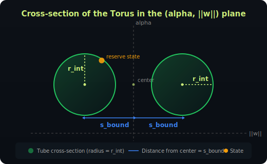

# 3. The Torus Invariant

> **Video explainer:** [Torus Formation Animation](assets/04_consolidation.mp4) -- watch interior and boundary spheres merge into the torus

This is the central mathematical result of Orbital — and what makes TaurusSwap possible. Multiple ticks with different parameters consolidate into a single equation that can be verified in constant time.

## 3.1 Why Consolidation Matters

A real pool has many ticks: LP Alice provides liquidity for a $0.99 depeg range, LP Bob covers $0.95, LP Charlie covers $0.999. Each tick is a separate sphere with its own (r, k) parameters.

Naively checking each tick's invariant would cost O(ticks × n). With 100 LPs and 5 tokens, that's 500 sphere checks per trade — way over Algorand's opcode budget.

**Consolidation** collapses all ticks into exactly **two** effective spheres. Those two spheres form a **torus**. The torus equation needs only two aggregates (`Σxᵢ` and `Σxᵢ²`) and three consolidation parameters (`r_int`, `s_bound`, `k_bound`).

## 3.2 Tick States: Interior vs Boundary

At any moment, each tick is in one of two states:

### Interior

The reserve state is **inside** the tick's spherical cap: `α < k/√n` (reserves haven't diverged enough to hit the tick's boundary). The tick behaves like a full n-dimensional sphere AMM.

### Boundary

The reserve state has reached the tick's boundary plane: `α = k/√n`. Prices have diverged enough that this tick's liquidity is fully utilized. The tick behaves like an (n-1)-dimensional sphere in the subspace orthogonal to v.

**Analogy to Uniswap V3:** An interior tick is like a V3 position that's "in range." A boundary tick is like a position that's "out of range" — its liquidity has been fully converted.

## 3.3 Consolidation Rules

### All interior ticks → one sphere

If multiple ticks are all interior, no-arbitrage forces their reserve vectors to be parallel. They behave as a single sphere with:

```
r_int = Σ rᵢ    (for all interior ticks i)
```

Simply add the radii. More liquidity = bigger sphere = deeper market.

### All boundary ticks → one (n-1)-sphere

Boundary ticks live in the orthogonal subspace. Each has an effective radius in that subspace:

```
sᵢ = √(rᵢ² - (kᵢ - rᵢ√n)²)
```

They consolidate to:

```
s_bound = Σ sᵢ    (for all boundary ticks)
k_bound = Σ kᵢ    (sum of k-values)
```

### Implementation

```python
# From contracts/orbital_math/consolidation.py
def consolidate_ticks(ticks, n):
    r_int = 0
    s_bound = 0
    k_bound = 0
    for tick in ticks:
        if tick.state == INTERIOR:
            r_int += tick.r
        else:  # BOUNDARY
            s_i = sqrt(tick.r² - (tick.k - tick.r * sqrt(n))²)
            s_bound += s_i
            k_bound += tick.k
    return r_int, s_bound, k_bound
```

## 3.4 Deriving the Torus Equation

After consolidation, we have:
- An interior sphere in full n-dimensional space (radius `r_int`)
- A boundary sphere in the (n-1)-dimensional orthogonal subspace (radius `s_bound`)

Their combined reserves form the total reserve vector.

### Step 1: Decompose total reserves

```
α_total = Σxᵢ / √n             (total projection onto v)
α_int   = α_total - k_bound    (interior's share)
```

The boundary ticks contribute exactly `k_bound` to the projection (by definition of being on their boundary planes).

### Step 2: Decompose orthogonal component

By no-arbitrage, the orthogonal components of interior and boundary ticks are **parallel** (not just the same direction, but scalar multiples). So norms add linearly:

```
‖w_total‖ = ‖w_int‖ + ‖w_bound‖
‖w_int‖   = ‖w_total‖ - s_bound
```

Where:
```
‖w_total‖ = √(Σxᵢ² - (Σxᵢ)²/n)
```

### Step 3: Apply the interior sphere constraint

The interior sphere satisfies:

```
r_int² = (α_int - r_int·√n)² + ‖w_int‖²
```

### Step 4: Substitute

```
r_int² = (α_total - k_bound - r_int·√n)² + (‖w_total‖ - s_bound)²
```

**This is the torus invariant.** It's called a torus because the equation has the form `R² = (a - f(R))² + (b - S)²`, which describes a generalized torus — the surface swept by orbiting one circle (the interior sphere's cross-section) around another (the boundary sphere).

## 3.5 Why It's O(1)

The invariant depends on:

| Quantity | Update cost per trade |
|----------|----------------------|
| `Σxᵢ` | O(1): add d_in, subtract d_out |
| `Σxᵢ²` | O(1): update two squared terms |
| `r_int` | O(1): no change within a segment (changes only at tick crossings) |
| `s_bound` | O(1): no change within a segment |
| `k_bound` | O(1): no change within a segment |

**Total verification: ~55 opcodes for n=5.** Well within Algorand's budget even without pooling.

The miracle is that n could be 10,000 and the verification cost would be **identical**. The only n-dependent cost is storing the reserves themselves, not checking the invariant.

## 3.6 Why It's a Torus (Geometric Intuition)

A **torus** (donut) is formed by sweeping a small circle around a larger circle. Here:

- The **large circle** is the boundary sphere in the orthogonal subspace (radius `s_bound`)
- The **small circle** is the interior sphere's cross-section (radius `r_int`)
- The **sweeping** comes from the interior sphere being centered at a point that sits at distance `r_int·√n` from the origin along the v-direction

The valid reserve states live on this donut surface. As trades happen, the reserve point moves along the surface. The contract checks that it stays on the surface.

<p align="center">
  
</p>

## 3.7 On-Chain Verification Code

From `contracts/smart_contracts/orbital_pool/contract.py`:

```python
# The contract stores:
#   sum_x     = Σxᵢ  (in scaled units)
#   sum_x_sq  = Σxᵢ² (in scaled units)
#   r_int     = consolidated interior radius
#   s_bound   = consolidated boundary radius
#   k_bound   = sum of boundary k-values

# After a trade updates reserves[in] and reserves[out]:
new_sum_x = sum_x + (new_in - old_in) - (old_out - new_out)
new_sum_x_sq = sum_x_sq + new_in² - old_in² + new_out² - old_out²

# Verify the torus invariant holds within TOLERANCE
residual = torus_check(new_sum_x, new_sum_x_sq, n, r_int, s_bound, k_bound)
assert abs(residual) <= TOLERANCE
```

## 3.8 Implementation Reference

| Layer | File | Key Function |
|-------|------|-------------|
| Python | `orbital_math/torus.py` | `verify_torus()`, `torus_residual()` |
| Python | `orbital_math/consolidation.py` | `consolidate_ticks()` |
| TypeScript | `sdk/src/math/torus.ts` | `torusInvariant()`, `isValidState()` |
| TypeScript | `sdk/src/math/consolidation.ts` | `consolidateTicks()` |
| Contract | `contract.py` | inline verification in `swap()` |
