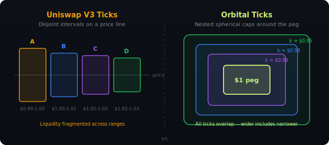

# 4. Tick Mechanics

> **Video explainer:** [Ticks and Caps Animation](assets/03_ticks_and_caps.mp4) -- spherical caps as concentrated liquidity regions

Ticks are Orbital's mechanism for concentrated liquidity. Each tick defines a region of the sphere surface where an LP provides liquidity. Unlike Uniswap V3's disjoint intervals, Orbital ticks are **nested spherical caps** — larger ticks contain smaller ones.

## 4.1 What Is a Tick?

A tick is defined by two parameters:

| Parameter | Meaning |
|-----------|---------|
| **r** (radius) | How much liquidity the LP provides. Larger r = deeper market. |
| **k** (plane constant) | How far from the peg the LP is willing to cover. Larger k = wider coverage (handles more depeg). |

Geometrically, the tick boundary is a hyperplane perpendicular to v:

```
x · v = k    (equivalently: Σxᵢ / √n = k)
```

This hyperplane slices the sphere, creating a **spherical cap** — the region closer to the peg than the boundary. Points inside the cap satisfy `x · v < k`.

### Nested, not disjoint

<p align="center">
  
</p>

A tick with k = $0.999 (tight peg) is contained entirely within a tick with k = $0.95 (wide coverage). The wider tick provides liquidity at all the same prices plus the depeg range.

## 4.2 Valid Range for k

The plane constant k must satisfy:

```
k_min ≤ k ≤ k_max
```

Where:
- **k_min** = `r(√n - 1)` — the boundary passes through the equal-price point itself. Zero-width tick, no liquidity.
- **k_max** = `r(n-1)/√n` — the boundary passes through the full-depeg point (one token at 0). Covers everything.

For a 5-token pool with r = 18,000:
```
k_min = 18,000 × (√5 - 1) ≈ 22,249
k_max = 18,000 × 4/√5    ≈ 32,197
```

## 4.3 Virtual Reserves and Capital Efficiency

### The minimum reserve per token

Within a tick, the minimum value any single token can reach is:

```
c = n·r - k·√n
x_min = r - (c + √((n-1)·(n·r² - c²))) / n
```

This x_min is the floor — reserves can never go below it inside this tick. These are the **virtual reserves**: they exist in the math but the LP doesn't need to deposit them.

### Actual deposit per token

The LP only deposits the difference between the equal-price reserves and the virtual reserves:

```
deposit = q - x_min
       = r(1 - 1/√n) - x_min(r, k, n)
```

### Capital efficiency

```
capital_efficiency = q / deposit = q / (q - x_min)
```

This ratio tells you how much more capital-efficient a concentrated tick is compared to a full-range Curve position.

## 4.4 Capital Efficiency Table (n = 5)

| Depeg Price Threshold | k / k_max | Capital Efficiency | Meaning |
|----------------------|-----------|-------------------|---------|
| $0.999 | ~0.70 | **~1,500x** | Extremely tight peg — massive efficiency but tiny range |
| $0.99 | ~0.75 | **~150x** | Sweet spot for stablecoins |
| $0.95 | ~0.83 | **~30x** | Moderate depeg tolerance |
| $0.90 | ~0.88 | **~15x** | Wide coverage |
| $0.50 | ~0.97 | **~3x** | Covers severe depeg |
| $0.00 | 1.00 | **1x** | Full range, same as Curve |

**Interpretation:** At the $0.99 row, an LP needs only $1 to provide the same liquidity depth that a Curve LP provides with $150.

## 4.5 Mapping k to a Depeg Price

Given a tick (r, k), what depeg price triggers the boundary?

The depegged token reaches `x_max(r, k, n)` while others fall to `x_other`. The depeg price is:

```
p_depeg = (r - x_max) / (r - x_other)
```

The inverse operation — computing k from a target depeg price — uses binary search over k values:

```python
# From contracts/orbital_math/ticks.py
def k_from_depeg_price(p_target, r, n):
    lo, hi = k_min(r, n), k_max(r, n)
    for _ in range(80):  # bisection steps
        mid = (lo + hi) // 2
        p_mid = depeg_price_for_k(r, mid, n)
        if p_mid > p_target:
            lo = mid + 1
        elif p_mid < p_target:
            hi = mid - 1
        else:
            return mid
    return best
```

## 4.6 Scaling (AMOUNT_SCALE)

Raw ASA amounts on Algorand use 6 decimals (microunits). Squaring a 10-billion-microunit reserve would overflow uint64. TaurusSwap introduces `AMOUNT_SCALE = 1,000`:

```
scaled_value = raw_microunits / 1,000
```

This reduces math values from ~10¹⁰ to ~10⁷, keeping all squares safely within uint64 (10⁷² = 10¹⁴ << 1.84×10¹⁹ max uint64).

**Important:** The `r` and `k` parameters passed to `add_tick` must be in scaled units. The `reserves` box remains in raw microunits. The contract handles conversion internally.

## 4.7 Implementation Reference

| Layer | File | Key Functions |
|-------|------|--------------|
| Python | `orbital_math/ticks.py` | `k_min()`, `k_max()`, `x_min()`, `x_max()`, `capital_efficiency()`, `k_from_depeg_price()` |
| TypeScript | `sdk/src/math/ticks.ts` | `kMin()`, `kMax()`, `xMin()`, `xMax()`, `capitalEfficiency()`, `kFromDepegPrice()` |
| Contract | `contract.py` | inline x_min computation in `add_tick()` |
