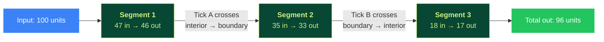
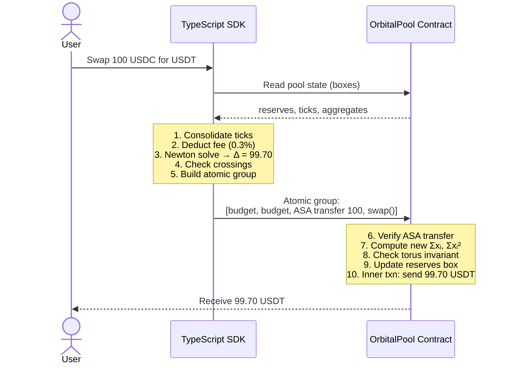

# 5. Trade Execution

> **Video explainer:** [Trade Execution Animation](assets/05_trade_execution.mp4) -- end-to-end swap visualization

This document explains how a swap actually works in TaurusSwap — from the user's input to the final on-chain settlement.

## 5.1 The Trade Problem

A user wants to swap `d` units of token i for as much of token j as possible.

Starting from reserves `x`, the new reserves must satisfy:
```
x'ᵢ = xᵢ + d        (pool receives d of token i)
x'ⱼ = xⱼ - Δ        (pool gives Δ of token j — this is what we solve for)
x'ₘ = xₘ             (all other tokens unchanged)
```

The value Δ must satisfy the torus invariant:

```
r_int² = (α'_total - k_bound - r_int·√n)² + (‖w'_total‖ - s_bound)²
```

Where `α'_total` and `‖w'_total‖` use the new reserves. This is a **quartic equation** in Δ.

## 5.2 Why Quartic?

The torus invariant has a square root (`‖w_total‖ = √(Σxᵢ² - (Σxᵢ)²/n)`). After squaring both sides to eliminate it, the highest power of Δ is 4:

- `Σx'ᵢ²` contains `(xⱼ - Δ)²` which contributes Δ² terms
- After squaring the full equation, Δ² × Δ² = Δ⁴

**This is why the contract doesn't solve it.** Solving a quartic on-chain would be expensive and numerically fragile. Instead:
- The SDK solves it off-chain using Newton's method
- The contract verifies the proposed Δ satisfies the invariant

## 5.3 Newton's Method (SDK Solver)

### Initial guess

Use the instantaneous spot price:

```
Δ₀ = d × (r_int - xᵢ) / (r_int - xⱼ)
```

This is exact for infinitesimal trades and a good starting point for finite ones.

### Iteration

```
for each iteration:
    residual = torus_invariant(reserves_with_delta)
    derivative = numerical_derivative(residual, delta)
    delta -= residual / derivative
    
    if |residual| < TOLERANCE:
        return delta
```

The solver uses a hybrid approach:
1. **Bracket finding** — sample the residual at multiple points to find a sign change
2. **Newton steps** — fast convergence near the root
3. **Bisection fallback** — guaranteed convergence if Newton oscillates

### Convergence

For typical stablecoin swaps, Newton converges in 3-5 iterations. The solver has hard limits:
- `MAX_NEWTON_ITERS = 50`
- `MAX_BISECTION_STEPS = 80`
- `TOLERANCE = 1,000` (in PRECISION units)

### Implementation

```python
# From contracts/orbital_math/newton.py (simplified)
def solve_single_segment_swap(amount_in, token_in, token_out, reserves, ticks):
    consolidated = consolidate_ticks(ticks, n)
    
    # Initial guess from spot price
    guess = amount_in * (r_int - reserves[token_in]) / (r_int - reserves[token_out])
    
    # Find bracket containing the root
    bracket = find_bracket(build_result, old_out, guess)
    
    # Newton + bisection hybrid
    for _ in range(MAX_ITERS):
        residual = torus_residual(new_sum, new_sum_sq, ...)
        if abs(residual) <= TOLERANCE:
            return result
        # Newton step with bisection guard
        derivative = numerical_derivative(...)
        next_guess = current - residual / derivative
        # Clamp to bracket bounds
        ...
    
    return best_result
```

## 5.4 Tick Crossings

During a large trade, the system state might cross a tick boundary — an interior tick becomes boundary or vice versa. When this happens, the consolidation parameters change and the invariant equation itself changes.

### Detection

For each tick, compute its **normalized projection**:

```
k_norm = k / r    (per-tick)
α_int_norm = α_int / r_int    (current state)
```

A tick is interior iff `k_norm > α_int_norm`. A crossing happens when:
- `α_int_norm` exceeds `k_norm` of the smallest interior tick → it becomes boundary
- `α_int_norm` falls below `k_norm` of the largest boundary tick → it becomes interior

### Trade segmentation

The SDK handles crossings by splitting the trade into segments:



Each segment uses different consolidation parameters. The SDK:
1. Assumes no crossing, computes the full trade
2. Checks if any tick crossed
3. If yes: binary-searches for the exact crossing point
4. Executes the partial trade up to the crossing
5. Flips the tick's state
6. Repeats with remaining input

### On-chain verification of segmented trades

The contract receives the full segment list in the transaction. For each segment, it:
1. Verifies the proposed output satisfies the torus invariant (with the segment's consolidation params)
2. Updates reserves and aggregates
3. Flips the crossed tick's state

## 5.5 Fee Handling

Before computing the trade output, a fee is deducted from the input:

```
fee = amount_in × fee_bps / 10,000
effective_input = amount_in - fee
```

The fee is distributed pro-rata to LPs based on their share of `total_r`. Each LP's claimable fees accumulate in a `fee_growth` accumulator:

```
fee_growth[i] += fee_charged[i] × PRECISION / total_r
```

Each LP position stores a checkpoint. Claimable fees = `position_r × (fee_growth - checkpoint) / PRECISION`.

## 5.6 The Full Swap Flow



## 5.7 Implementation Reference

| Layer | File | Key Functions |
|-------|------|--------------|
| Python | `orbital_math/newton.py` | `solve_single_segment_swap()` |
| Python | `orbital_math/crossings.py` | `find_first_crossing()`, `segment_swap()` |
| TypeScript | `sdk/src/math/newton.ts` | `solveSwapNewton()` |
| TypeScript | `sdk/src/math/tick-crossing.ts` | `executeTradeWithCrossings()` |
| TypeScript | `sdk/src/pool/swap.ts` | `executeSwap()`, `getSwapQuote()` |
| Contract | `contract.py` | `swap()`, `swap_crossing()` |
