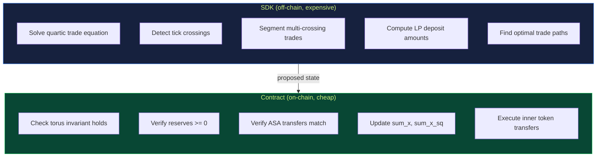

# 6. Smart Contract

The OrbitalPool smart contract is an ARC-4 contract written in Algorand Python (PuyaPy). Its job is narrow and well-defined: **verify proposed state transitions, then execute them**. It never solves the hard math.

## 6.1 Design Principle: Verify, Don't Compute



This is the same asymmetry that makes zero-knowledge proofs work: solving is hard, verifying is easy.

## 6.2 Storage Layout

### Global State (16 keys)

| Key | Type | Description |
|-----|------|-------------|
| `n` | uint64 | Number of tokens in the pool |
| `bootstrapped` | uint64 | 1 if pool is initialized |
| `registered_tokens` | uint64 | Count of registered ASAs |
| `sum_x` | uint64 | `Σxᵢ` in scaled units |
| `sum_x_sq` | uint64 | `Σxᵢ²` in scaled units |
| `r_int` | uint64 | Consolidated interior radius |
| `s_bound` | uint64 | Consolidated boundary radius |
| `k_bound` | uint64 | Sum of boundary k-values |
| `virtual_offset` | uint64 | Per-token virtual reserve offset |
| `num_ticks` | uint64 | Total tick count |
| `sqrt_n` | uint64 | Precomputed √n × ROOT_PRECISION |
| `inv_sqrt_n` | uint64 | Precomputed 1/√n × ROOT_PRECISION |
| `paused` | uint64 | Emergency pause flag |
| `fee_bps` | uint64 | Fee in basis points (e.g. 30 = 0.3%) |
| `creator` | bytes | Creator address |
| `total_r` | uint64 | Sum of r across ALL ticks |

### Box Storage

| Box Name | Size | Contents |
|----------|------|----------|
| `reserves` | n × 8 bytes | Per-token reserves in raw microunits |
| `fee_growth` | n × 8 bytes | PRECISION-scaled fee accumulator per token |
| `token:{idx}` | 8 bytes | ASA ID for token at index idx |
| `tick:{id}` | 25 bytes | TickData: r(8) + k(8) + state(1) + total_shares(8) |
| `pos:{owner}{tick_id}` | 8 + n×8 bytes | LP position: shares(8) + fee checkpoints(n×8) |

### Scaling

```
_AMOUNT_SCALE = 1,000

Invariant math uses: scaled = raw_microunits / AMOUNT_SCALE
Reserves box stores:  raw microunits (no scaling)
r and k parameters:   scaled units
```

## 6.3 Contract Methods

### Lifecycle

| Method | Description |
|--------|-------------|
| `bootstrap(n, fee_bps)` | Initialize pool with n tokens and fee rate |
| `register_token(asset)` | Register an ASA (called n times after bootstrap) |
| `set_fee(fee_bps)` | Update the fee (creator only) |
| `pause()` / `unpause()` | Emergency controls (creator only) |

### Trading

| Method | Description |
|--------|-------------|
| `swap(token_in_idx, token_out_idx, min_out)` | Single-segment swap |
| `swap_crossing(segments, ...)` | Multi-segment swap with tick crossings |
| `budget()` | No-op that donates 700 opcodes to the group |

### Liquidity

| Method | Description |
|--------|-------------|
| `add_tick(r, k)` | Create a new tick and LP position |
| `remove_liquidity(tick_id)` | Withdraw principal + accrued fees |
| `claim_fees(tick_id)` | Settle fees without withdrawing principal |

### Read API (all readonly)

| Method | Returns |
|--------|---------|
| `get_pool_info()` | Full pool snapshot including total_r |
| `get_tick_info(tick_id)` | TickData for one tick |
| `get_position(owner, tick_id)` | Shares + position_r |
| `get_reserves()` | Raw n×8 bytes of reserves |
| `get_fee_growth()` | Raw n×8 bytes of fee accumulator |
| `get_registered_tokens()` | Raw n×8 bytes of ASA IDs |
| `get_fees_for_position(owner, tick_id)` | Claimable fees per token |
| `list_ticks(start, limit)` | Paginated tick listing |
| `get_price(in_idx, out_idx)` | Instantaneous spot price |

## 6.4 Swap Verification (The Core)

The contract's swap handler does this:

```
1. Verify preceding ASA transfer in the atomic group
2. Load current reserves from box storage
3. Deduct fee from input amount
4. Compute new_sum_x  = sum_x + scaled_in - scaled_out
5. Compute new_sum_sq = sum_x_sq + new_in² - old_in² + new_out² - old_out²
6. Evaluate torus residual:
     lhs = r_int²
     rhs = (α_int - r_int·√n)² + (‖w‖ - s_bound)²
     residual = lhs - rhs
7. Assert |residual| ≤ TOLERANCE
8. Persist new reserves, sum_x, sum_x_sq
9. Inner transaction: send output tokens to the user
```

**Opcode cost:** ~55 for n=5. The budget() calls in the atomic group provide extra headroom.

## 6.5 Multi-LP Position Accounting (v2)

In v2, multiple LPs can provide liquidity at different ticks:

- Each `add_tick` creates a position box: `pos:{owner_32bytes}{tick_id_8bytes}`
- Position stores: shares (8 bytes) + fee_growth checkpoint per token (n × 8 bytes)
- `TickData.total_shares` tracks the aggregate
- Fees are distributed pro-rata via the `fee_growth` accumulator

### Fee-growth checkpoint pattern

```
On add_tick:
    position.checkpoint[i] = fee_growth[i]    (for all i)

On claim_fees:
    claimable[i] = position_r × (fee_growth[i] - checkpoint[i]) / PRECISION
    position.checkpoint[i] = fee_growth[i]    (reset)
```

This prevents double-claiming and handles multiple LPs correctly.

## 6.6 Atomic Transaction Groups

All contract interactions use Algorand atomic groups:

### Swap group

```
[budget(), budget(), ASA_transfer(in), app_call(swap)]
```

### Add liquidity group

```
[budget(), budget(), ASA_transfer(token_0), ..., ASA_transfer(token_n-1), app_call(add_tick)]
```

The budget() calls are no-op app calls that each donate 700 opcodes to the group's pooled budget. For n=5, two budget calls provide 2,100 total opcodes — sufficient for add_tick and swap.

## 6.7 Implementation Reference

| File | Purpose |
|------|---------|
| `contracts/smart_contracts/orbital_pool/contract.py` | The full ARC-4 contract |
| `contracts/smart_contracts/orbital_pool/deploy_config.py` | AlgoKit deploy hook |
| `contracts/smart_contracts/artifacts/orbital_pool/` | Compiled TEAL + ARC56 |
