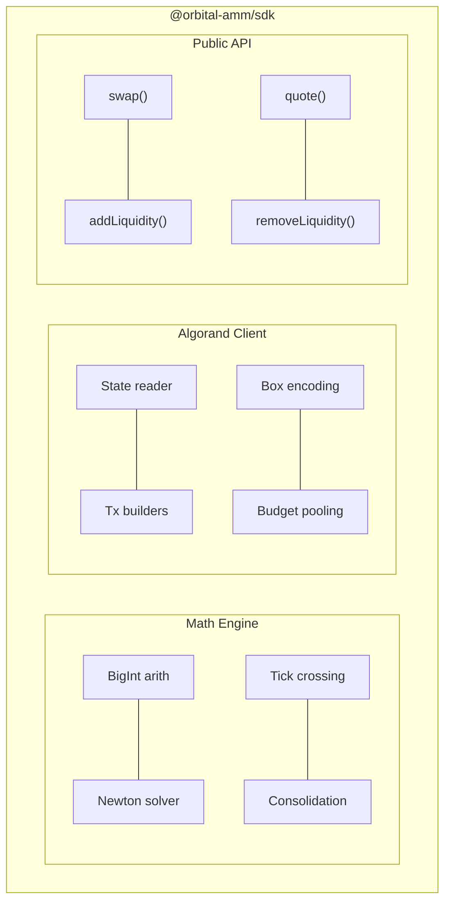

# 7. TypeScript SDK

The `@orbital-amm/sdk` package is the off-chain brain of TaurusSwap. It solves the hard math, builds Algorand transactions, and exposes a clean API for the frontend.

## 7.1 Three Responsibilities



## 7.2 Math Engine (`src/math/`)

All math uses JavaScript's native `BigInt` — no floating point anywhere in the computation path.

### Core modules

| File | Purpose | Key Exports |
|------|---------|-------------|
| `bigint-math.ts` | Primitives | `sqrt()`, `abs()`, `mulScaled()`, `divScaled()`, `clamp()` |
| `sphere.ts` | Sphere AMM | `sphereInvariant()`, `getPrice()`, `equalPricePoint()`, `solveSwapSphere()` |
| `torus.ts` | Torus invariant | `torusInvariant()`, `isValidState()` |
| `ticks.ts` | Tick geometry | `kMin()`, `kMax()`, `xMin()`, `xMax()`, `capitalEfficiency()`, `kFromDepegPrice()` |
| `consolidation.ts` | Consolidation | `consolidateTicks()`, `normalizedInteriorProjection()` |
| `newton.ts` | Trade solver | `solveSwapNewton()` |
| `tick-crossing.ts` | Crossings | `executeTradeWithCrossings()` |

### Precision constants

```typescript
export const PRECISION       = 1_000_000_000n;      // 10^9
export const PRECISION_SQ    = PRECISION * PRECISION; // 10^18
export const AMOUNT_SCALE    = 1_000n;               // raw → scaled
export const TOLERANCE       = 1_000n;               // verification margin
```

### Example: getting a swap quote

```typescript
import { getSwapQuote, readPoolState, createAlgodClient } from "@orbital-amm/sdk";

const algod = createAlgodClient({ server: "https://testnet-api.algonode.cloud", port: 443 });
const pool = await readPoolState(algod, appId);

const quote = await getSwapQuote({
  pool,
  tokenInIdx: 0,    // USDC
  tokenOutIdx: 2,   // DAI
  amountIn: 1_000_000n,  // 1 USDC (6 decimals)
});

console.log(quote.amountOut);     // ~999_700n (0.9997 DAI after fees)
console.log(quote.priceImpact);   // ~0.01%
console.log(quote.segments);      // [{amountIn, amountOut, tickCrossed?}]
```

## 7.3 Algorand Client (`src/algorand/`)

### State reader

`readPoolState()` reads all on-chain data in a single call:
- Global state (n, fees, consolidation params, aggregates)
- Reserves box
- All tick boxes
- Fee growth accumulator

Returns a typed `PoolState` object the math engine consumes.

### Transaction builders

| Function | Builds |
|----------|--------|
| `buildSwapGroup()` | `[budget, budget, ASA transfer, app call(swap)]` |
| `buildCrossingSwapGroup()` | Multi-segment swap with crossing data |
| `buildAddTickGroup()` | `[budget, budget, ASA transfers × n, app call(add_tick)]` |
| `buildRemoveLiquidityGroup()` | `[budget, budget, app call(remove_liquidity)]` |
| `buildClaimFeesGroup()` | `[budget, budget, app call(claim_fees)]` |

### Box encoding

The SDK encodes and decodes box names and values:

```typescript
// Box name encoding
encodeBoxName("reserves")                    // Bytes("reserves")
encodeBoxMapKey("tick", tickId)              // "tick:" + uint64BE(tickId)
encodePositionBoxKey(ownerAddr, tickId)      // "pos:" + pubkey(32) + uint64BE(tickId)

// Box value decoding
decodeTickBox(raw)       // → { r, k, state, totalShares }
decodeReservesBox(raw)   // �� BigInt[]
decodePositionBox(raw, n) // → { shares, checkpoints: BigInt[] }
```

## 7.4 Public API (`src/pool/`)

### Swap

```typescript
const result = await executeSwap({
  algod,
  appId,
  signer,
  senderAddress,
  tokenInIdx: 0,
  tokenOutIdx: 2,
  amountIn: 1_000_000n,
  slippageBps: 50,  // 0.5% max slippage
});
// result.txId, result.amountOut, result.segments
```

### Add Liquidity

```typescript
const result = await addLiquidity({
  algod,
  appId,
  signer,
  senderAddress,
  depegPrice: 990_000_000n,  // $0.99 in PRECISION
  depositPerToken: 10_000_000_000n,  // 10,000 tokens per asset
});
// result.tickId, result.r, result.k, result.depositPerToken
```

### Remove Liquidity

```typescript
const result = await removeLiquidity({
  algod, appId, signer, senderAddress,
  tickId: 0,
});
// result.withdrawnAmounts: BigInt[] (per token)
// result.claimedFees: BigInt[] (per token)
```

### Claim Fees

```typescript
const result = await claimFees({
  algod, appId, signer, senderAddress,
  tickId: 0,
});
// result.claimedFees: BigInt[] (per token)
```

## 7.5 Type Definitions

```typescript
interface PoolState {
  appId: number;
  n: number;
  reserves: bigint[];
  tokenIds: number[];
  ticks: Tick[];
  sumX: bigint;
  sumXSq: bigint;
  rInt: bigint;
  sBound: bigint;
  kBound: bigint;
  totalR: bigint;
  feeBps: number;
  sqrtN: bigint;
  invSqrtN: bigint;
}

interface Tick {
  tickId: number;
  r: bigint;
  k: bigint;
  state: TickState;
  totalShares: bigint;
}

enum TickState { INTERIOR = 0, BOUNDARY = 1 }

interface SwapQuote {
  amountOut: bigint;
  priceImpact: number;
  segments: TradeSegment[];
  fee: bigint;
}

interface TradeSegment {
  amountIn: bigint;
  amountOut: bigint;
  tickCrossedId?: number;
  newState?: TickState;
}
```

## 7.6 Testing

```bash
cd sdk
npm test
```

Test suites:
- `math.test.ts` — sphere, torus, ticks, consolidation against known values
- `swap.test.ts` — Newton solver convergence, edge cases
- `brutal.test.ts` — randomized fuzz testing of solver
- `integration.test.ts` — full swap flow against localnet
