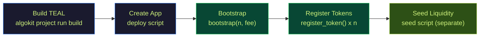
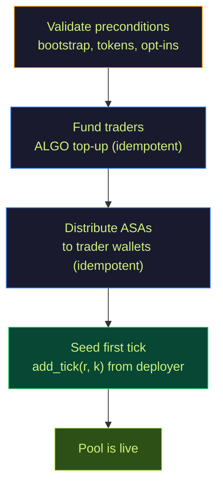

# 8. Deployment Guide

This document covers deploying TaurusSwap to Algorand localnet and testnet, including the post-deploy liquidity seeding step.

## 8.1 Prerequisites

| Tool | Version | Purpose |
|------|---------|---------|
| Python | 3.12+ | Contract build, math simulator, tests |
| AlgoKit CLI | v2+ | Build, deploy, manage localnet |
| Docker | Latest | AlgoKit localnet containers |
| Node.js | 18+ | SDK and frontend |

## 8.2 The Deployment Pipeline



**Important:** Deployment and seeding are separate steps. The deploy script creates and configures the pool. The seed script adds the first liquidity tick and distributes test tokens.

## 8.3 Localnet Deployment

```bash
cd contracts
source ~/python/bin/activate

# Start localnet
algokit localnet start

# Build contract artifacts
algokit project run build

# Deploy (creates app, funds it, bootstraps, registers tokens)
algokit project deploy localnet

# Verify with integration tests
RUN_LOCALNET=1 python -m pytest tests/test_orbital_pool_localnet.py -v
```

## 8.4 Testnet Deployment

### Option A: Create mock ASAs

```bash
cd contracts
source ~/python/bin/activate

export ORBITAL_MNEMONIC="your 25-word testnet mnemonic"
export ORBITAL_CREATE_MOCK_ASSETS=1

algokit project deploy testnet
```

### Option B: Use existing ASAs

```bash
export ORBITAL_MNEMONIC="your 25-word testnet mnemonic"
export ORBITAL_ASSET_IDS="123,456,789,101112,131415"

algokit project deploy testnet
```

### Deploy output

The deploy script prints:

```
app_id:             758226184
app_address:        ABC123...XYZ
creator:            DEPLOYER_ADDRESS
network:            testnet
tokens:             [ASA_1, ASA_2, ASA_3, ASA_4, ASA_5]
fee_bps:            30
```

## 8.5 Post-Deploy Seeding

After deployment, the pool exists but has no liquidity. The seeding script:



### Seeding command

```bash
cd contracts
source ~/python/bin/activate

# Required
export ORBITAL_APP_ID=758226184
export ORBITAL_MNEMONIC="your 25-word testnet mnemonic"

# Trader wallets (must have already opted into pool ASAs)
export ORBITAL_TRADER_ADDRESSES="ADDR1,ADDR2"

# Tick parameters
export ORBITAL_SEED_R=18000000              # Radius in scaled units
export ORBITAL_DEPEG_PRICE_SCALED=998000000 # $0.998 depeg tolerance

# Run
python scripts/seed_testnet_pool.py
```

### What the seed parameters mean

| Parameter | Default | Meaning |
|-----------|---------|---------|
| `ORBITAL_SEED_R` | 18,000,000 | Tick radius in scaled units. At this value: ~9,950 tokens per asset, ~49,750 total |
| `ORBITAL_DEPEG_PRICE_SCALED` | 998,000,000 | $0.998 -- tolerates 0.2% depeg. The script derives k from this price via binary search |
| `ORBITAL_TRADER_TOKEN_AMOUNT` | 1,000,000,000 | 1,000 tokens (in microunits) to each trader per ASA |
| `ORBITAL_TRADER_FUND_MICROALGOS` | 500,000 | 0.5 ALGO to each trader for fees |

### Slippage at default seed

With r = 18,000,000 and depeg = 0.998:
- **~0.01%** slippage on 1-token swaps
- **~0.12%** slippage on 10-token swaps

### Idempotency

The seed script is designed for safe re-runs:
- ALGO top-up skipped if trader already has enough
- ASA distribution skipped if trader already holds enough
- Tick seeding blocked if pool already has ticks (override with `--allow-nonempty-pool`)

### Dry run

```bash
python scripts/seed_testnet_pool.py --dry-run
```

Validates all preconditions without sending any transactions.

## 8.6 Environment Variables Reference

### Deploy variables

| Variable | Required | Description |
|----------|----------|-------------|
| `ORBITAL_MNEMONIC` | Yes* | 25-word testnet mnemonic |
| `ORBITAL_ACCOUNT_NAME` | Alt* | AlgoKit account alias (loads `{NAME}_MNEMONIC`) |
| `ORBITAL_CREATE_MOCK_ASSETS` | One of | Set to `1` to create mock ASAs |
| `ORBITAL_ASSET_IDS` | One of | CSV of existing ASA IDs |
| `ORBITAL_N` | No | Number of tokens (default: 5) |
| `ORBITAL_FEE_BPS` | No | Initial fee in basis points |
| `ORBITAL_FUND_MICROALGOS` | No | App funding amount |
| `ORBITAL_DEPLOY_JSON` | No | `1` for JSON output |
| `ORBITAL_DEPLOY_OUTPUT` | No | Path to write deploy summary |

*Provide either `ORBITAL_MNEMONIC` or `ORBITAL_ACCOUNT_NAME`

### Seed variables

| Variable | Required | Description |
|----------|----------|-------------|
| `ORBITAL_APP_ID` | Yes | Deployed app ID |
| `ORBITAL_MNEMONIC` | Yes | Deployer mnemonic |
| `ORBITAL_TRADER_ADDRESSES` | No | CSV of trader wallets |
| `ORBITAL_SEED_R` | No | Tick radius (default: 18,000,000) |
| `ORBITAL_SEED_K` | No | Explicit k (overrides depeg price) |
| `ORBITAL_DEPEG_PRICE_SCALED` | No | Depeg price to derive k (default: 998,000,000) |
| `ORBITAL_TRADER_TOKEN_AMOUNT` | No | ASAs per trader (default: 1,000,000,000) |
| `ORBITAL_TRADER_FUND_MICROALGOS` | No | ALGO per trader (default: 500,000) |
| `ORBITAL_SEED_OUTPUT` | No | Path to write seed summary |

## 8.7 Common Issues

| Problem | Cause | Fix |
|---------|-------|-----|
| `mnemonic length must be 25` | Invalid mnemonic | Use a real 25-word Algorand mnemonic |
| `Testnet deployment needs explicit assets` | Neither mock nor existing assets specified | Set `ORBITAL_CREATE_MOCK_ASSETS=1` or `ORBITAL_ASSET_IDS` |
| `txn dead: round ... outside of ...` | Stale transaction params | Pull latest code and retry |
| Localnet unreachable | Docker not running | `algokit localnet start` |
| Trader opt-in missing | Traders haven't opted into ASAs | Have traders opt in before running seed |
| `pool already has ticks` | Re-running seed | Use `--allow-nonempty-pool` flag |
