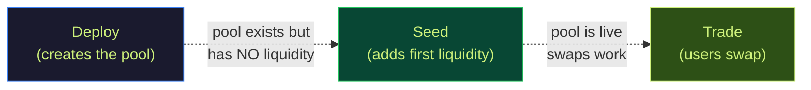
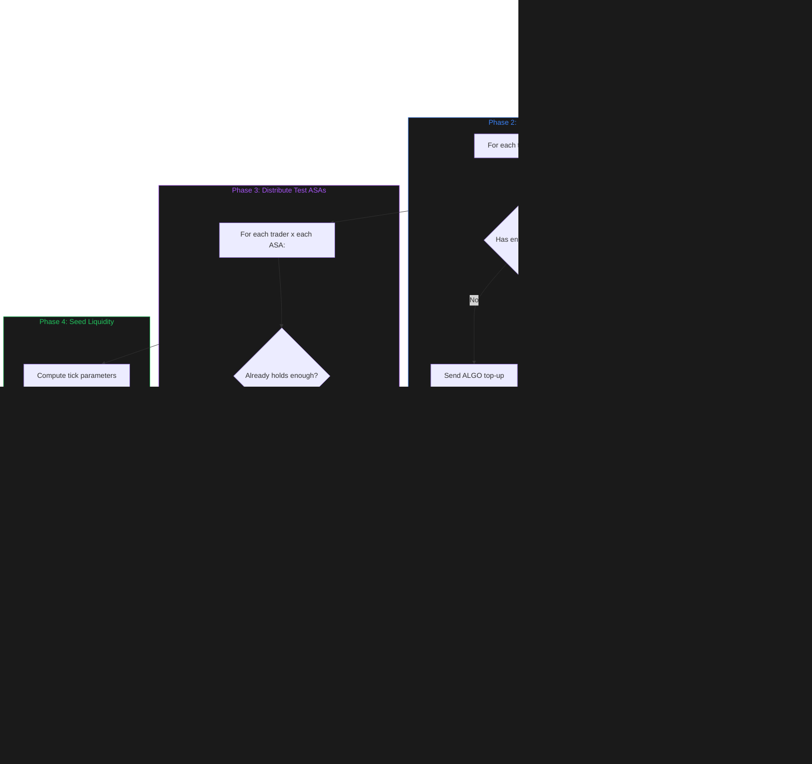
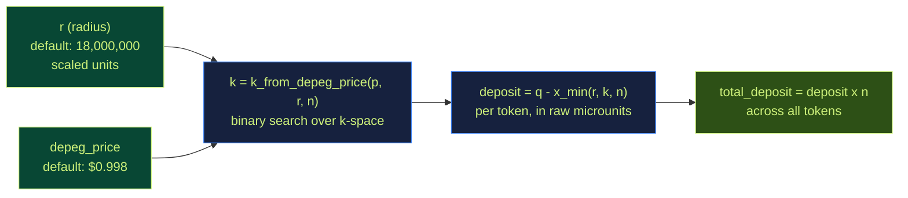
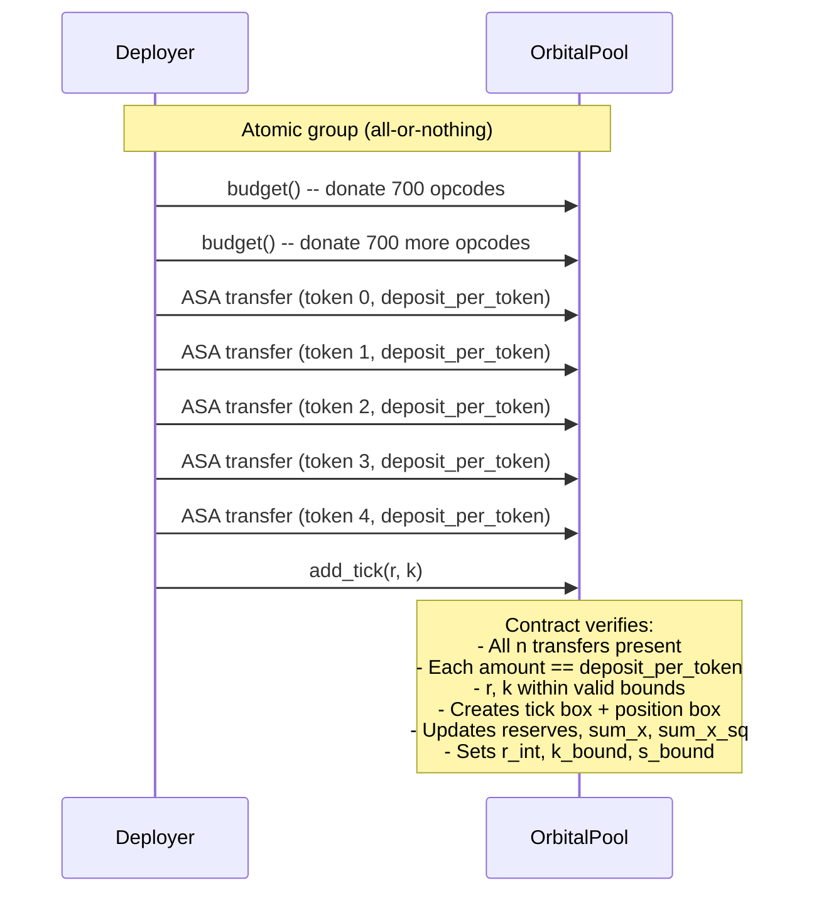
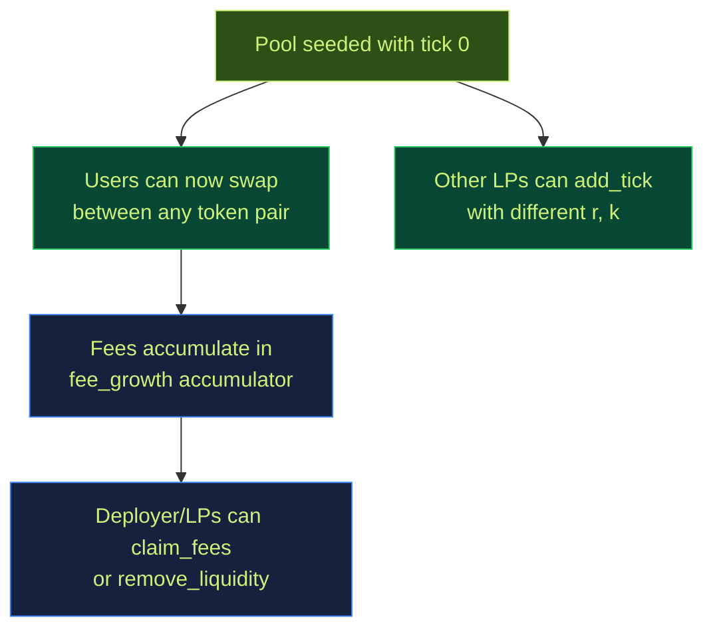

# 10. The Seeding Process

> **Video explainer:** [Seeding Animation](assets/06_seeding_process.mp4) -- visual walkthrough of how a pool goes from empty to live

This document explains how TaurusSwap pools go from deployed-but-empty to fully operational with initial liquidity. Seeding is a critical post-deploy step — a pool without liquidity cannot process any swaps.

---

## 10.1 Why Seeding Is Separate



Deployment creates the app, registers tokens, and initializes storage. But it does **not** add any liquidity. This is intentional:

- **Trader wallets must opt into pool ASAs first** — Algorand requires ASA opt-in before receiving tokens
- **Seeding requires a separate funding decision** — the deployer chooses how much capital to commit and what depeg tolerance to use
- **Idempotency** — the seed script can be re-run safely after failures without double-spending

---

## 10.2 The Full Seeding Flow



---

## 10.3 Phase 1: Validation

Before any transaction is sent, the script validates every precondition. If any check fails, the script exits with a clear error message.

| Check | What It Verifies | Failure Message |
|-------|-----------------|-----------------|
| Bootstrap | `global_state.bootstrapped == 1` | "App is not bootstrapped. Run deploy first." |
| Token registration | `registered_tokens == n` | "Only X/n tokens registered." |
| Existing ticks | `num_ticks == 0` (by default) | "Pool already has ticks." (use `--allow-nonempty-pool` to override) |
| Trader opt-ins | Each trader has opted into all pool ASAs | "Trader X: missing opt-in for assets [...]" |
| Deployer balance | Deployer holds enough of every ASA for traders + seed | "Owner does not hold enough of every ASA" |

---

## 10.4 Phase 2: Fund Trader Wallets

Each trader wallet needs ALGO to pay transaction fees when swapping. The script tops up each wallet to a target balance (default: 0.5 ALGO = 500,000 microAlgos).

**Idempotency:** If a trader already has >= the target balance, the top-up is skipped.

```python
for trader in trader_addresses:
    current_algo = algo_balance(trader)
    if current_algo >= target:
        print(f"  Skipped {trader} (already has {current_algo})")
        continue
    send_payment(deployer -> trader, target - current_algo)
```

---

## 10.5 Phase 3: Distribute Test ASAs

Each trader receives test tokens for swap testing. The script sends `trader_token_amount` (default: 1,000,000,000 microunits = 1,000 tokens at 6 decimals) of each pool ASA.

**Idempotency:** If a trader already holds >= the target amount of an ASA, that distribution is skipped.

```python
for trader in trader_addresses:
    for asset_id in pool_token_ids:
        current_holding = asset_balance(trader, asset_id)
        if current_holding >= target_amount:
            print(f"  Skipped ASA {asset_id} for {trader}")
            continue
        send_asset_transfer(deployer -> trader, target_amount - current_holding)
```

---

## 10.6 Phase 4: Seed the First Liquidity Tick

This is the core step. The deployer creates the pool's first tick — a concentrated liquidity position.

### Computing tick parameters



**Step 1: Choose r** -- The radius in scaled units. Default is 18,000,000 which means ~18,000 tokens of radius, translating to ~9,950 tokens per asset deposited.

**Step 2: Derive k from depeg price** -- Given a target depeg price (default: $0.998 = 998,000,000 in PRECISION units), the script uses binary search over the valid k range to find the k that produces exactly that depeg threshold.

```python
k = k_from_depeg_price(depeg_price_scaled=998_000_000, r=18_000_000, n=5)
```

**Step 3: Compute deposit per token** -- Using the tick geometry formulas:

```
q = r * (1 - 1/sqrt(n))                  # equal-price point
c = n * r - k * sqrt(n)                  # intermediate
discriminant = (n-1) * (n * r^2 - c^2)
x_min = r - (c + sqrt(discriminant)) / n  # virtual reserve floor

deposit_per_token = (q - x_min) * AMOUNT_SCALE   # back to raw microunits
```

### The atomic transaction group



The contract creates:
- **Tick box** `tick:0` -- stores r, k, state=INTERIOR, total_shares
- **Position box** `pos:{deployer}{0}` -- stores shares + fee growth checkpoints
- **Updates** reserves box, sum_x, sum_x_sq, r_int (= r), virtual_offset, total_r

After this transaction confirms, the pool is live and ready for swaps.

---

## 10.7 Default Seed Parameters

| Parameter | Default | What It Produces |
|-----------|---------|-----------------|
| `r` | 18,000,000 (scaled) | ~18,000 token radius |
| `depeg_price` | $0.998 | Tolerates 0.2% depeg before boundary |
| `deposit_per_token` | ~9,950,000 microunits | ~9.95 tokens per asset |
| `total_deposit` | ~49,750,000 microunits | ~49.75 tokens across 5 assets |
| Slippage on 1T swap | ~0.01% | Very low slippage |
| Slippage on 10T swap | ~0.12% | Still low |

---

## 10.8 Capital Efficiency of the Seed

The seed tick with depeg = $0.998 provides approximately **~500x capital efficiency** compared to a full-range position. This means:

- The deployer deposits only ~49.75 tokens total
- But provides the same liquidity depth as a Curve LP with ~24,875 tokens
- Trades within the $0.998-$1.002 range see deep liquidity
- If any token depegs below $0.998, the tick transitions to BOUNDARY state

---

## 10.9 Running the Seed Script

### Basic usage

```bash
cd contracts
source ~/python/bin/activate

export ORBITAL_APP_ID=758226184
export ORBITAL_MNEMONIC="your 25-word mnemonic"
export ORBITAL_TRADER_ADDRESSES="ADDR1,ADDR2"

python scripts/seed_testnet_pool.py
```

### Dry run (validate without sending)

```bash
python scripts/seed_testnet_pool.py --dry-run
```

### Custom tick parameters

```bash
# Wider coverage: $0.95 depeg tolerance
export ORBITAL_SEED_R=18000000
export ORBITAL_DEPEG_PRICE_SCALED=950000000

# Or specify k directly
python scripts/seed_testnet_pool.py --r 18000000 --k 28500000
```

### JSON output

```bash
python scripts/seed_testnet_pool.py --json --output seed_summary.json
```

Produces:

```json
{
  "network": "testnet",
  "app_id": 758226184,
  "app_address": "...",
  "creator": "...",
  "token_ids": [1001, 1002, 1003, 1004, 1005],
  "trader_addresses": ["ADDR1", "ADDR2"],
  "seeded_tick_id": 0,
  "seed_r": 18000000,
  "seed_k": 28234567,
  "seed_deposit_per_token": 9950000,
  "dry_run": false
}
```

---

## 10.10 What Happens After Seeding



Once seeded:
- **Swaps are live** -- users send tokens to the pool and receive tokens back, verified by the torus invariant
- **More LPs can join** -- any account can call `add_tick(r, k)` with their own parameters
- **Fees flow to LPs** -- swap fees accumulate pro-rata based on each LP's share of total_r
- **Positions are manageable** -- LPs can `claim_fees()` without withdrawing, or `remove_liquidity()` to exit entirely
