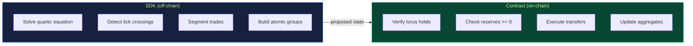

# TaurusSwap Documentation

Welcome to the full technical documentation for TaurusSwap — a multi-asset concentrated liquidity AMM built on Algorand using sphere and torus geometry from the [Orbital paper](https://www.paradigm.xyz/2025/06/orbital) by Paradigm.

---

## Reading Order

This documentation is structured to build understanding progressively. Each section builds on the previous one.

| # | Document | Summary | Time |
|---|----------|---------|------|
| 1 | [Problem Statement](01-problem-statement.md) | Why existing AMMs can't do multi-asset concentrated liquidity | 5 min |
| 2 | [Mathematical Foundations](02-mathematical-foundations.md) | The sphere AMM, pricing, equal-price point, polar decomposition | 15 min |
| 3 | [The Torus Invariant](03-torus-invariant.md) | Tick consolidation, the torus equation, and why verification is O(1) | 15 min |
| 4 | [Tick Mechanics](04-tick-mechanics.md) | Spherical caps, k-bounds, virtual reserves, capital efficiency tables | 10 min |
| 5 | [Trade Execution](05-trade-execution.md) | The quartic equation, Newton solver, tick crossings, segmented trades | 15 min |
| 6 | [Smart Contract](06-smart-contract.md) | On-chain architecture, box storage, fee accounting, verify-not-compute | 10 min |
| 7 | [TypeScript SDK](07-sdk.md) | Math engine, transaction builders, pool operations | 10 min |
| 8 | [Deployment Guide](08-deployment.md) | Localnet, testnet, seeding, environment variables | 10 min |
| 9 | [Seeding Process](10-seeding-process.md) | How pools go from empty to live with initial liquidity | 10 min |

---

## Quick Reference

### The One Equation That Matters

The torus invariant — the single equation the smart contract checks for every trade:

```
r_int² = (α_total - k_bound - r_int·√n)² + (‖w_total‖ - s_bound)²
```

Where:
- `α_total = Σxᵢ / √n` (scalar projection of reserves onto the equal-price direction)
- `‖w_total‖ = √(Σxᵢ² - (Σxᵢ)²/n)` (orthogonal component norm)
- `r_int` = sum of radii of all interior ticks
- `s_bound` = sum of boundary radii in orthogonal subspace
- `k_bound` = sum of k-values of all boundary ticks

Updating `Σxᵢ` and `Σxᵢ²` after a 2-token swap is **O(1)** — just arithmetic on two changed values.

### The Design Principle



### Capital Efficiency (n=5 pool)

| Depeg Threshold | Capital Efficiency vs Curve |
|-----------------|---------------------------|
| $0.99 | **~150x** |
| $0.95 | **~30x** |
| $0.90 | **~15x** |
| $0.50 | **~3x** |

An LP in a $0.99 depeg tick needs only 1/150th of the capital a Curve LP needs for the same liquidity depth.

---

## Video Explainers

We created manim-rendered animations (inspired by [Paradigm's visual approach](https://www.paradigm.xyz/2025/06/orbital)) that walk through each mathematical concept. Videos are embedded in the relevant doc pages and also available directly:

| Video | Explains | Duration |
|-------|----------|----------|
| [Sphere AMM](assets/01_sphere_amm.mp4) | 3D sphere surface, reserve point moving during trades | ~45s |
| [Polar Decomposition](assets/02_polar_decomposition.mp4) | Alpha and w component splitting | ~40s |
| [Ticks & Caps](assets/03_ticks_and_caps.mp4) | Spherical caps as concentrated liquidity regions | ~50s |
| [Torus Formation](assets/04_consolidation.mp4) | Interior + boundary spheres merging into the torus | ~60s |
| [Trade Execution](assets/05_trade_execution.mp4) | End-to-end swap: Newton solve, verify, output | ~50s |
| [Seeding Process](assets/06_seeding_process.mp4) | Pool seeding: validation, funding, add_tick | ~55s |

To re-render at higher quality:
```bash
source ~/python/bin/activate
cd animations
manim -qh 04_consolidation.py TorusFormation    # 1080p
```

---

## Source Paper

**Orbital** by Dave White, Dan Robinson, Ciamac Moallemi  
Paradigm, June 2025  
[paradigm.xyz/2025/06/orbital](https://www.paradigm.xyz/2025/06/orbital)
