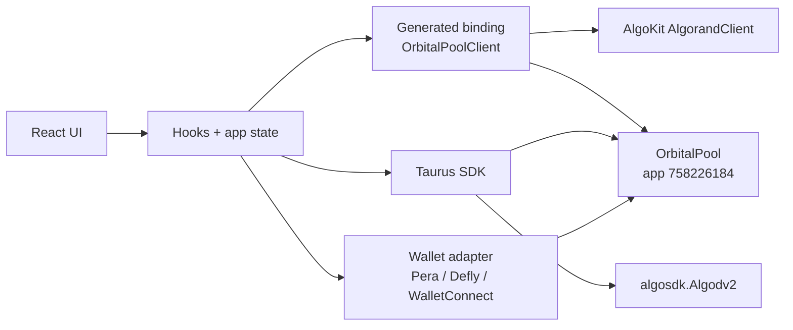
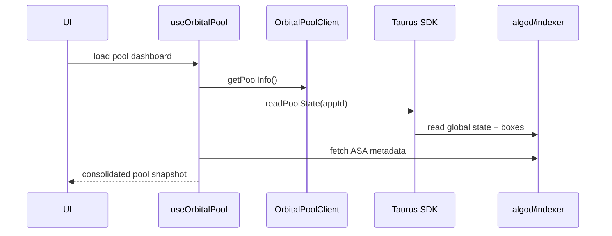
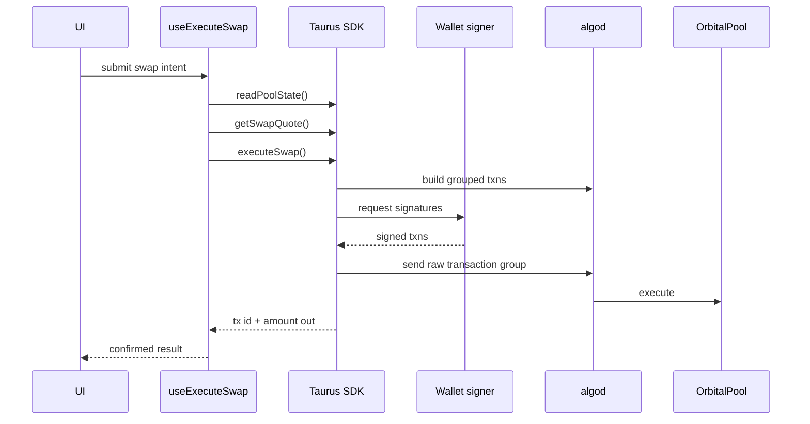

# Taurus Frontend Smart Contract Integration PRD

## Document Purpose

This PRD defines how the Taurus frontend should integrate with the deployed `OrbitalPool` smart contract on Algorand TestNet.

It is intentionally blunt about the current state:

- the contract is deployed
- the TypeScript binding is generated
- the SDK exists
- the frontend is still mostly a demo shell
- real contract integration has not happened yet

This document is the implementation specification for replacing the mock frontend with a real Taurus client.

---

## Deployment Target

- `app_id`: `758226184`
- `app_address`: `LRU5AZHCVFQBDCRXSHU3FASVV4ZS6EGUW7L33DDJRRDH7YSRGHJG4O26LA`
- `creator`: `7EDVQRVQXC2RPGCLSOEKJJ4DHPHODLC6PGO6AA2JDGIBKX3ABFCU4ENFFI`
- `account_source`: `mnemonic`
- `network`: `Algorand TestNet`
- `n`: `5`
- `sqrt_n_scaled`: `2236067977`
- `inv_sqrt_n_scaled`: `447213596`
- `fee_bps`: `30`
- `registered_tokens`:
  - `758226153`
  - `758226159`
  - `758226164`
  - `758226166`
  - `758226180`

These values are the runtime integration anchor for the frontend.

The `app_id` is the primary identifier used by the SDK and generated binding.

The `app_address` is a verification and display value. The frontend should compare the address derived from `app_id` against the expected address and surface a mismatch clearly.

---

## Brutal Current-State Assessment

### What exists

- A generated binding exists at [`src/contract/OrbitalPool.ts`](./src/contract/OrbitalPool.ts)
- The Taurus SDK exists in [`../sdk/src`](../sdk/src)
- The contract is live on testnet

### What does not exist

- no real Algorand wallet integration
- no real contract runtime config
- no service layer that reads live pool state
- no service layer that uses SDK quote or execution flows
- no live token registry from the contract
- no live LP positions view
- no contract-aware swap flow

### What is still fake

- wallet state in [`src/store/useAppStore.ts`](./src/store/useAppStore.ts)
- swap math in [`src/components/swap/SwapCard.tsx`](./src/components/swap/SwapCard.tsx)
- pool positions in [`src/pages/Pool.tsx`](./src/pages/Pool.tsx)
- network selector and branding in [`src/components/layout/Navbar.tsx`](./src/components/layout/Navbar.tsx)

### Core truth

The generated binding is not the integration.

It is only one piece of the integration.

If the frontend tries to call generated write methods like `swap`, `addTick`, or `removeLiquidity` directly, that will be the wrong architecture for this protocol.

This protocol requires grouped Algorand transactions, preceding ASA transfers, budget calls, foreign assets, and box references. That logic already lives in the SDK and must stay there.

---

## Product Goal

Build a Taurus frontend that:

- reads live contract state from `OrbitalPool`
- uses the SDK for quotes and transaction-group construction
- uses a real Algorand wallet signer for execution
- presents the system as a premium, reliable, Uniswap-quality trading experience
- is honest about protocol maturity and disabled paths

---

## Non-Goals

- reimplementing protocol math inside the frontend
- bypassing the SDK for write paths
- directly handcrafting grouped transactions in UI code
- pretending wallet signing works before it is actually wired
- claiming live LP positions if the underlying tick/account model is not fully surfaced yet

---

## Integration Principles

### 1. Binding for reads, SDK for writes

Use the generated binding for typed contract reads.

Use the SDK for:

- pool state decoding
- quote generation
- transaction-group construction
- execution helpers

### 2. `appId` is primary

Use `758226184` as the canonical runtime contract identifier.

The app address should be derived and verified, not treated as the primary key.

### 3. No frontend protocol math in floating point

All protocol amounts must remain `bigint` until final display formatting.

### 4. Refresh before signing

Every execution flow must:

1. reload pool state
2. recompute quote
3. compare against user intent
4. then request wallet signature

### 5. Honest UX over fake completeness

If a path is not wired or the pool has no liquidity, the UI must explicitly say so.

---

## Required Integration Architecture



### Layer responsibilities

#### UI layer

- forms
- validation
- loading states
- error states
- token selection
- slippage settings
- quote review
- transaction confirmation UX

#### Frontend service layer

- create clients
- pin runtime config
- fetch contract state
- map token metadata
- build display-ready quote models
- bridge wallet signer to SDK signer shape

#### Generated binding

Use it for:

- `getPoolInfo()`
- `getTickInfo()`
- `state.global.*`
- `state.box.*`

Do not use it as the primary write path for end-user trading.

#### SDK

Use it for:

- `readPoolState`
- `getSwapQuote`
- `executeSwap`
- `addLiquidity`
- `removeLiquidity`
- `computeDepositPerToken`
- `tickParamsFromDepegPrice`

---

## Why Direct Binding Writes Are Wrong

The contract expects grouped transactions.

From the SDK transaction builders in [`../sdk/src/algorand/transactions.ts`](../sdk/src/algorand/transactions.ts):

- swap requires:
  - preceding ASA transfer to the app address
  - budget calls
  - foreign assets
  - reserves box reference
- crossing swap requires:
  - preceding ASA transfer
  - budget calls
  - reserves box
  - crossed tick box references
  - encoded trade recipe bytes
- add liquidity requires:
  - budget calls
  - `n` ASA transfers immediately before the app call
  - token box refs
  - reserves box ref
- remove liquidity requires:
  - budget calls
  - reserves box
  - fees box
  - tick box ref

That means this is wrong:

- frontend directly calling generated `swap(...)`
- frontend directly calling generated `addTick(...)`
- frontend directly calling generated `removeLiquidity(...)`

That approach would ignore the required group shape.

---

## Binding-Specific Constraints

The generated binding in [`src/contract/OrbitalPool.ts`](./src/contract/OrbitalPool.ts) has an empty `APP_SPEC.networks`.

That means:

- `fromNetwork()` is not the correct construction path
- the frontend must instantiate the client with an explicit `appId`

Correct pattern:

```ts
new OrbitalPoolClient({
  algorand,
  appId: 758226184,
})
```

---

## Required Runtime Configuration

The frontend must support the following env vars:

```env
VITE_ALGOD_SERVER=
VITE_ALGOD_PORT=
VITE_ALGOD_TOKEN=
VITE_INDEXER_SERVER=
VITE_INDEXER_PORT=
VITE_INDEXER_TOKEN=
VITE_ORBITAL_APP_ID=758226184
VITE_ORBITAL_APP_ADDRESS=LRU5AZHCVFQBDCRXSHU3FASVV4ZS6EGUW7L33DDJRRDH7YSRGHJG4O26LA
VITE_ORBITAL_NETWORK=algorand-testnet
VITE_ORBITAL_NETWORK_NAME=Algorand TestNet
```

Defaults may point to AlgoNode testnet endpoints, but the app id and expected app address must be explicit and visible.

The runtime config should also support an optional preloaded token registry for UX bootstrapping:

```env
VITE_ORBITAL_TOKEN_IDS=758226153,758226159,758226164,758226166,758226180
```

This should be treated as a fallback and validated against the on-chain token boxes on startup.

---

## Required Frontend Modules

Create these modules under `src/lib/taurus/`:

### `config.ts`

- runtime env parsing
- default testnet config
- canonical app id/address

### `clients.ts`

- one cached `algosdk.Algodv2`
- one cached AlgoKit `AlgorandClient`

### `contract.ts`

- `getOrbitalPoolClient()`
- explicit app-id construction

### `amounts.ts`

- parse display strings to `bigint`
- format `bigint` token amounts safely

### `pool.ts`

- load pool snapshot
- call generated `getPoolInfo()`
- call SDK `readPoolState()`
- load ASA metadata
- verify derived address matches expected app address

### `swaps.ts`

- quote adapter around SDK `getSwapQuote`
- execute adapter around SDK `executeSwap`

### `liquidity.ts`

- preview deposit requirement
- preview depeg/range parameters
- execute add/remove through SDK

### `wallet-signer.ts`

- wallet-provider bridge
- converts wallet SDK shape to:

```ts
(txns: algosdk.Transaction[]) => Promise<Uint8Array[]>
```

---

## Required Hooks

Create these hooks:

- `useOrbitalPool()`
- `useSwapQuote()`
- `useExecuteSwap()`
- `useLiquidityPreview()`
- `useAddLiquidity()`
- `useRemoveLiquidity()`
- `useWalletSigner()`

These hooks should be the only place the UI talks to integration services.

---

## Required UI Changes

### Swap page

Replace the current mock swap card with:

- live token list from contract token registry
- live pool state
- real SDK quote
- real price impact
- real minimum received
- route/ticks-crossed summary
- signer-aware CTA states

CTA states must include:

- `Loading contract`
- `Pool unavailable`
- `No liquidity`
- `Enter an amount`
- `Connect Algorand wallet`
- `Review swap`
- `Signer integration pending`

### Pool page

Replace the mock positions screen with:

- live pool summary
- registered token list
- tick registry
- fee bps
- paused status
- app id + app address
- contract health panel
- LP preview inputs

If LP ownership is not fully represented in the frontend yet, the page must say that clearly.

### Navbar

Replace:

- fake network selector
- fake brand
- fake wallet badge

With:

- Taurus branding
- Algorand TestNet status
- app id badge
- wallet status

### Portfolio page

Do not show fake balances or fake activity.

Until wallet integration is real, replace the page with:

- wallet connection state
- testnet integration status
- contract-linked account actions planned for later

---

## Read Integration Flow



### Read responsibilities

The binding should give:

- typed `PoolInfo`
- typed tick read helpers
- typed state accessors

The SDK should give:

- decoded reserve arrays
- tick list
- token ASA ids
- decimals
- math-ready state

---

## Swap Execution Flow



### Swap implementation rules

- frontend never hand-builds swap groups
- frontend never hand-encodes crossing recipes
- frontend never computes protocol output with floats
- frontend always re-reads state before submit

---

## Liquidity Flow

The liquidity UI must use SDK helpers:

- `computeDepositPerToken`
- `tickParamsFromDepegPrice`
- `addLiquidity`
- `removeLiquidity`

The user-facing mental model should be:

- choose desired depeg protection
- preview required deposit per token
- preview tick params
- sign grouped txns

Not:

- manually enter raw `r` and `k` unless advanced mode is explicitly enabled

---

## Wallet Integration Requirements

This is the real blocker for live writes.

The frontend needs a real Algorand wallet adapter with:

- account address retrieval
- opt-in checks where needed
- transaction signing for grouped txns

Candidate wallet targets:

- Pera Wallet
- Defly
- WalletConnect-compatible Algorand providers

The frontend store should track:

- `isWalletConnected`
- `walletAddress`
- `networkId`
- `walletProvider`
- `signerStatus`

It should not default to:

- fake Ethereum address
- fake connected state
- fake network list

---

## Acceptance Criteria

The integration is complete only when all of the following are true:

### Contract reads

- frontend loads pool data from `app_id 758226184`
- displayed app address matches `LRU5AZHCVFQBDCRXSHU3FASVV4ZS6EGUW7L33DDJRRDH7YSRGHJG4O26LA`
- displayed creator matches `7EDVQRVQXC2RPGCLSOEKJJ4DHPHODLC6PGO6AA2JDGIBKX3ABFCU4ENFFI`
- token registry is read from on-chain token boxes
- tick registry is read from on-chain tick boxes
- on-chain pool metadata reflects `n = 5`, `fee_bps = 30`, `sqrt_n_scaled = 2236067977`, and `inv_sqrt_n_scaled = 447213596`

### Quotes

- swap quote uses SDK `getSwapQuote`
- quote is driven by live state, not mock token prices
- route and tick-crossing count are surfaced in the UI

### Writes

- swap submit uses SDK `executeSwap`
- LP add uses SDK `addLiquidity`
- LP remove uses SDK `removeLiquidity`
- wallet signs grouped Algorand transactions

### UX honesty

- no fake wallet address remains
- no fake Ethereum network selector remains
- no fake token balances remain
- no fake TVL/portfolio data remains on contract-driven screens

### Build hygiene

- app builds successfully
- SDK imports resolve cleanly
- generated binding works in the browser build
- required polyfills are in place if needed

---

## Major Risks

### 1. Deployed does not mean usable

If the deployed app has no registered tokens or no liquidity ticks, the frontend can read it but cannot offer meaningful trading.

### 2. Wallet integration is the actual execution blocker

The biggest gap is not the binding. It is the signer.

### 3. Demo code creates false confidence

The current UI looks advanced, but its core flows are still fake.

### 4. Direct binding writes will break protocol assumptions

If someone bypasses the SDK and uses generated methods directly for user writes, the integration will be wrong.

---

## Implementation Phases

### Phase 1: Runtime + read path

- add config module
- add algod/algoKit client module
- instantiate `OrbitalPoolClient` with `appId`
- read pool info
- read pool state through SDK
- resolve ASA metadata
- replace navbar network identity

### Phase 2: Live swap quote path

- replace mock swap card token list
- add live quote hook
- add slippage-aware quote display
- add route/ticks-crossed summary
- add no-liquidity and pool-unavailable states

### Phase 3: Wallet integration + swap execution

- integrate real Algorand wallet provider
- bridge signer to SDK
- wire `executeSwap`
- add confirmation and error UX

### Phase 4: Liquidity flows

- add depeg-driven LP preview
- wire `addLiquidity`
- wire `removeLiquidity`
- replace mock positions/pool cards

### Phase 5: Hardening

- app address verification
- stale quote handling
- better error surfaces
- opt-in detection and guidance
- testnet network mismatch handling

---

## Final Decision

The integration must be built like this:

- generated binding for typed reads
- SDK for quotes and transaction groups
- wallet signer for execution
- contract runtime pinned to `758226184`

Anything else is either incomplete or structurally wrong.
